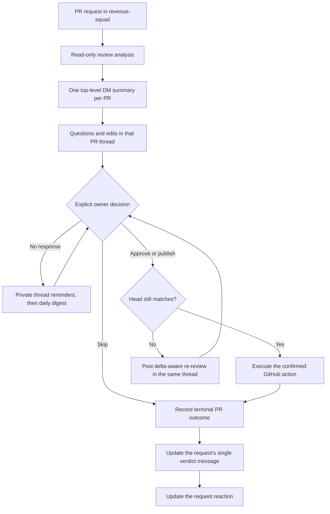
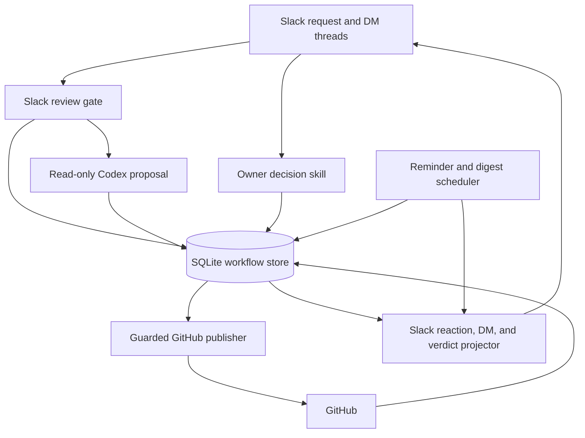
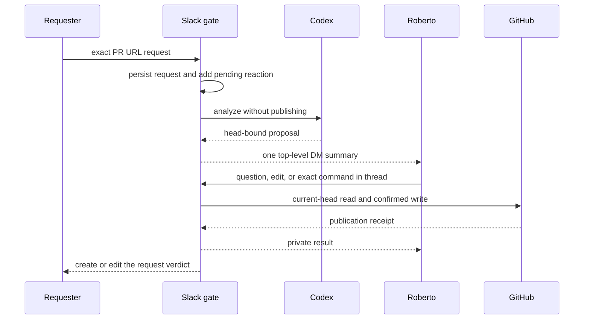
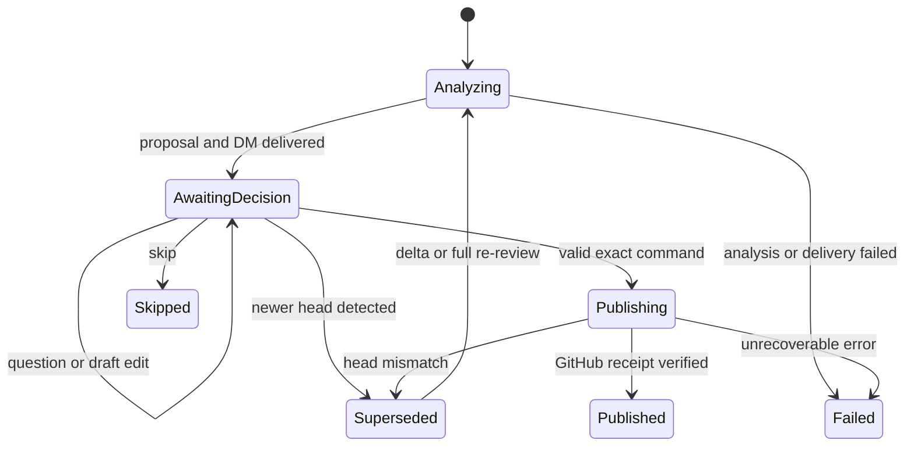
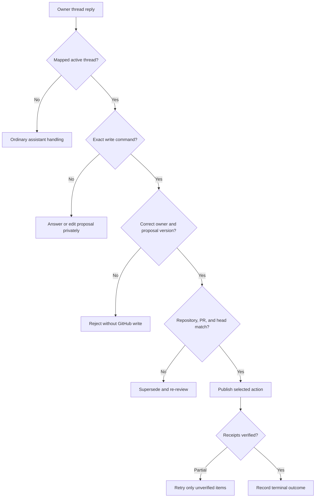
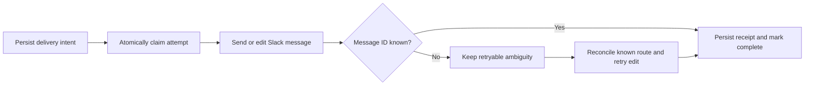

# Private PR Review Confirmation - Plan

## Goal Capsule

- **Objective:** The revenue squad can request timely PR reviews while Roberto privately verifies each proposed decision, so only intentional feedback for the current PR revision reaches GitHub and the squad channel stays low-noise.
- **Means:** Add a durable, two-phase, commit-bound review inbox to the existing Slack-to-Codex review flow. (KTD1-KTD3)
- **Product authority:** Roberto makes the final approve, publish, or skip decision; existing allowed reviewers and bots retain their current request permissions.
- **Open blockers:** None.

---

## Product Contract

### Summary

PR requests will continue to enter through the revenue-squad channel, but every review decision will move to a private Slack conversation with Roberto.
Hermes will send one top-level DM summary per PR and keep questions, reminders, re-reviews, and the final action in that message's thread.
The original request thread will contain one compact verdict message that is updated as its PRs finish.

### Problem Frame

The autonomous reviewer currently publishes immediately, so weak findings reach GitHub before a human can challenge them.
A review of 30 root comments posted from September 10 through September 17, 2026 classified 15 as mechanical or convention-only, three as useful but overly prescriptive, and 12 as material defects or risks.
The main source of avoidable churn is policy: the current gate makes every test-coverage finding approval-blocking, including assertion placement and magic values.

Moving every PR into the full sequential decision-review workflow would prevent automatic noise, but it would also make human attention the throughput limit.
The private confirmation step keeps the automated analysis while reducing the human task to evaluating a concise proposal and asking for evidence only when needed.

### Key Decisions

- **Private confirmation before GitHub writes.** (session-settled: user-directed — chosen over autonomous publication and full manual review: it keeps final judgment human without requiring a full review.) Governs R4-R6.
- **One DM thread per PR.** (session-settled: user-directed — chosen over grouping multiple PRs in one message: each review keeps its own context and actions.) Governs R2-R3.
- **Bounded private reminders.** (session-settled: user-approved — chosen over indefinite silence or channel escalation: reminders preserve attention without public spam.) Governs R12-R14.
- **Delta-aware re-review.** (session-settled: user-directed — chosen over presenting an unqualified full summary again: the reviewer needs to see what changed since the prior revision.) Governs R9-R11.
- **One shared verdict per request.** (session-settled: user-directed — chosen over one public message per PR: the squad gets the outcome without message fan-out.) Governs R15.

### Actors

- A1. **Review requester:** An allowed squad member or trusted bot that submits one or more exact PR URLs.
- A2. **Review agent:** Hermes and Codex, which collect evidence, analyze the PR, prepare the private proposal, and execute only a confirmed action.
- A3. **Decision owner:** Roberto, who asks questions and approves, edits, publishes, dismisses, or skips the proposal.
- A4. **GitHub:** The authoritative source for PR identity, head revision, discussions, and published review state.

### Requirements

**Public intake and private review workspace**

- R1. During analysis and pending decisions, an accepted request exposes no channel messages; its current state is represented by a reaction, and terminal outcomes follow R15.
- R2. The review agent sends one top-level DM summary for each requested PR, including when one request contains multiple PR URLs.
- R3. Questions, evidence, proposed-comment edits, reminders, re-review summaries, and decisions for a PR remain in that summary's Slack thread.
- R4. Each DM summary identifies the repository, PR, exact reviewed head, objective, proposed decision, material findings with evidence, and the actions available to the decision owner.

**Decision quality and publication**

- R5. The review agent must not approve a PR or publish a comment until the configured decision owner explicitly authorizes that action in the matching PR thread.
- R6. The decision owner can request clarification or evidence, edit or dismiss individual proposed comments, approve the current head when GitHub permits approval, publish the selected comments, or skip the review.
- R7. Candidate comments must describe an evidence-backed risk to behavior, security, persistent data, migration safety, rollout compatibility, or meaningful regression coverage; mechanical test arrangement, assertion constants, and speculative abstraction preferences are withheld.
- R8. Immediately before a GitHub write, the review agent verifies the repository, PR number, intended action, and current head; a mismatch rejects the action and starts re-review behavior.

**Re-review behavior**

- R9. A re-review uses the exact previously reviewed head as its baseline and the latest PR head as its target.
- R10. The re-review adds a concise delta summary to the existing PR thread covering changed behavior, relevant files or structural units, previous findings that are addressed or still open, and new risks introduced since the baseline.
- R11. A new head invalidates every pending decision for an earlier head, and only the proposal for the latest analyzed head can be executed.

**Private reminders**

- R12. An unanswered proposal receives its first reminder in the existing PR thread after two working hours.
- R13. If it remains unanswered, it receives one more thread reminder on the next working morning and then appears only in the daily private digest.
- R14. Missing responses never trigger a GitHub action or a new top-level DM reminder.

**Shared completion status**

- R15. The review agent posts exactly one compact verdict message in the original request thread and edits that message as its PRs finish; each entry contains only the PR identity, outcome, reviewed head, and published-comment count when applicable.

### Review Flow

### Key Flows

- F1. **New review request**
  - **Trigger:** A1 submits one or more allowed PR URLs.
  - **Actors:** A1, A2, A3, A4
  - **Steps:** A2 acknowledges without channel text, analyzes each PR, and creates a separate private summary per R1-R4.
  - **Outcome:** Every PR has an isolated decision thread bound to its reviewed head.
- F2. **Clarification and publication**
  - **Trigger:** A3 replies in a PR summary thread.
  - **Actors:** A2, A3, A4
  - **Steps:** A2 answers from evidence and revises the proposal until A3 selects an action; A2 then applies the freshness gate in R8.
  - **Outcome:** GitHub receives only the action and comments A3 confirmed under R5-R8, and the shared verdict reflects the result under R15.
- F3. **Re-review after a new commit**
  - **Trigger:** The PR head no longer matches the head in the pending or prior review.
  - **Actors:** A2, A3, A4
  - **Steps:** A2 invalidates the stale action, compares the two heads, and adds the R10 delta summary to the existing thread.
  - **Outcome:** A3 decides using the latest revision without losing the earlier discussion.
- F4. **Unanswered review**
  - **Trigger:** A3 has not acted within the reminder window.
  - **Actors:** A2, A3
  - **Steps:** A2 follows R12-R14 and leaves the proposal pending.
  - **Outcome:** The review stays visible privately without producing public noise or an automatic GitHub action.

### Acceptance Examples

- AE1. **Covers R1-R4.** Given one channel message containing three eligible PR URLs, when analysis completes, then Roberto receives three top-level DM summaries and the channel contains only status reactions.
- AE2. **Covers R3, R6.** Given a proposed comment in one PR summary, when Roberto asks for evidence in its thread, then the answer and any edited proposal stay in that thread and do not affect another PR.
- AE3. **Covers R5, R12-R14.** Given an unanswered proposal, when two working hours and the next working morning pass, then both reminders appear in its thread, the proposal enters the daily digest, and GitHub remains unchanged.
- AE4. **Covers R8-R11.** Given a pending approval for one head, when the author pushes a new commit, then the approval is rejected as stale and a delta summary appears in the existing thread before another decision is accepted.
- AE5. **Covers R7.** Given a review that finds only assertion placement, a numeric assertion constant, or a preference to extract a one-use helper, when the proposal is prepared, then those items do not become candidate GitHub comments.
- AE6. **Covers R5-R8.** Given one material candidate comment, when Roberto edits its wording and confirms publication, then only the edited comment is posted to the matching PR and current head.
- AE7. **Covers R9-R11.** Given a previous finding that was fixed and an unrelated risk introduced later, when re-review runs, then the delta summary marks the old finding addressed and presents the new risk separately.
- AE8. **Covers R1-R3, R15.** Given one request containing three PRs that finish at different times, when each decision completes, then the original thread retains one verdict message whose three entries are updated without exposing private analysis.

### Success Criteria

- Audited GitHub review actions satisfy the owner-confirmation and head-freshness rules in R5 and R8.
- Multi-PR requests satisfy the separate-summary and thread isolation rules in R2-R3.
- Channel behavior satisfies R1 and R15 with one compact verdict per original request and no public analysis, questions, or reminders.
- Reminder behavior satisfies R12-R14 entirely within the private PR thread and digest.
- Re-review output satisfies R9-R11 by distinguishing addressed, still-open, and newly introduced concerns against the exact prior head.
- Replaying the analyzed seven-day sample against R7 withholds the identified mechanical findings while retaining the material defect and risk findings for confirmation.

### Scope Boundaries

- The feature does not run the full human-driven decision briefing for every PR; deeper evidence is available on request in the private thread.
- The feature does not merge or close PRs, submit `REQUEST_CHANGES`, or broaden the repositories and users allowed by the existing Slack policy.
- The feature does not combine multiple PRs into one summary, one thread, or one publication action.
- The feature does not post review explanations, reminders, or decision prompts in the revenue-squad channel; R15 is the only allowed verdict message.
- The feature does not retain mechanical findings as candidate comments; R7 is the publication-quality boundary.

### Dependencies

- The configured Slack owner remains the sole decision owner for this workflow.
- The pinned Hermes Slack adapter supports user-ID-to-DM resolution, threaded sends, message edits, and reaction add/remove; this repository must wrap and test those capabilities.
- Pending proposals, reviewed heads, reminder timestamps, and decisions survive process restarts and remain isolated by repository and PR.
- The existing daily digest is configured to reach the intended owner in the deployed environment; the repository defines the owner fallback but cannot verify the live recipient value.
- Working-hour calculations use the deployment timezone.
- Completed Slack history and database audit records follow the existing retention posture; this feature does not add automatic deletion.

### Sources and Research

- `skills/pr-reviewer/SKILL.md` — current immediate-publication contract.
- `skills/pr-reviewer/references/severity-rubric.md` — current approval gate and mechanical test findings that block approval.
- `skills/pr-decision-review/SKILL.md` — existing guarded, head-bound action behavior suitable for reuse.
- `plugins/slack-pr-review-gate/__init__.py` — current owner-DM access, text acknowledgement, and single-response restriction.
- `automation/review_automation.py` — current PR-head identity, idempotency, and GitHub reconciliation behavior.
- `config/crons.json` — existing daily private review digest schedule.
- [Seven-day example: reset token lost on locale change](https://github.com/reservamos/reserhub-revenue-web/pull/751#discussion_r3983803495).
- [Seven-day example: scraper failures reported as successful empty results](https://github.com/reservamos/scrapers-swarm/pull/305#discussion_r4010503854).
- [Seven-day example: mechanical assertion constant](https://github.com/reservamos/price-engine-python/pull/4131#discussion_r3993113470).

---

## Planning Contract

### Key Technical Decisions

- KTD1. **Split analysis from publication.** Codex produces and persists a read-only proposal first; a separate deterministic action path performs GitHub writes only after confirmation. (session-settled: user-approved — chosen over immediate autonomous publication: Roberto approved private confirmation before any GitHub write.) Covers R4-R8.
- KTD2. **Route review conversations by durable Slack identity.** The plugin resolves a private reply by workspace, DM channel, and thread root before the normal owner-DM bypass, then injects only the matching opaque proposal identity into the decision skill. Ordinary owner DMs remain unchanged. Covers R2-R6.
- KTD3. **Use revision-bound text commands for mutations and write authorization.** The latest summary shows a short proposal revision token; only `approve <revision>`, `publish <revision> <candidate IDs>`, and `skip <revision>` authorize terminal decisions or GitHub writes, while `edit <revision> <candidate ID>: <text>` and `dismiss <revision> <candidate IDs>` mutate the draft without publishing. A missing or inactive revision token is rejected, and all other language remains read-only. Covers R5-R6 and R11.
- KTD4. **Separate stable Slack conversations from head-specific proposals.** A PR conversation is unique by workspace, owner, repository, and PR number; immutable proposal revisions carry reviewed and baseline heads, while each source request separately owns its verdict message. Covers R2-R3 and R9-R15.
- KTD5. **Use SQLite as the workflow authority.** Requests, request members, PR conversations, proposal revisions, findings, decisions, delivery attempts, reminders, and publication receipts use transactional claims and uniqueness constraints; Slack reactions and messages are projections. Covers R1-R15.
- KTD6. **Detect revision and PR lifecycle drift at existing interaction points.** Repeated intake, every owner-thread interaction, each reminder sweep, and the pre-publication guard check the current head and whether the PR remains open; an externally merged or closed PR becomes terminal, stops reminders, and updates its source verdict. No GitHub webhook or continuous poller is added. Covers R8-R14.
- KTD7. **Schedule bounded reminders with deterministic working time.** The reminder sweep runs every 15 minutes in `${TZ}`, counts Monday-Friday 09:00-18:00 with no holiday calendar, sends the first reminder after 120 working minutes, sends the second at 09:00 on the next weekday, and then leaves the proposal digest-only. Covers R12-R14.
- KTD8. **Reconcile external effects before advancing state.** Slack sends attach a stable workflow key as message metadata and recover an ambiguous receipt by searching only the exact conversation or thread for that key; if absence cannot be proved, delivery stays blocked for operator recovery instead of reposting. GitHub action attempts bind the expected commit and replay only unverified items. A concurrent post-check head change is reported privately and triggers re-review rather than being represented as current. Covers R5, R8, and R15.

### Assumptions

- `SLACK_REVIEW_DIGEST_USER_ID` identifies exactly one decision owner and is a member of `SLACK_REVIEW_OWNER_USER_IDS`; startup validation fails closed otherwise.
- A repeated request for an active PR reuses its private PR conversation while associating the new source request with the eventual outcome.
- A clean non-self-authored PR proposes approval but still waits for `approve`; a self-authored PR never offers approval and can only publish comments or be skipped.
- An explicit `approve` may override retained material findings because Roberto is the final decision owner; the proposal must keep those findings visible at confirmation time.
- When a force-push makes the exact baseline comparison unavailable, the old proposal is superseded and the agent performs a full latest-head review labeled as having no reliable delta.
- A revised proposal resets the first-reminder clock; unanswered proposals remain in each daily private digest until terminal.
- The public verdict is created on the first terminal PR outcome, renders all request members from current persisted state, and is never duplicated as a fallback when an edit fails.

### Slack Display State Contract

| Persisted state | Source-request reaction | Verdict outcome |
|---|---|---|
| `analyzing`, `awaiting_decision`, `re_reviewing`, `publishing` | `eyes` while any request member is non-terminal | `pending` for unfinished members after the verdict exists |
| `published` with approval | `white_check_mark` when every member is terminal without failure | `approved` |
| `published` with comments | `white_check_mark` when every member is terminal without failure | `comments published` plus verified inline-comment count |
| `skipped` | `white_check_mark` when every member is terminal without failure | `skipped` |
| externally merged or closed | `white_check_mark` when every member is terminal without failure | `merged externally` or `closed externally` |
| `failed` or operator-blocked delivery/publication | `warning` once any member reaches that state | `failed` with no private detail |

The reaction is derived from the whole request: `warning` wins over `eyes`, and `eyes` wins over `white_check_mark`.

### High-Level Technical Design

The diagrams describe responsibilities and safety boundaries, not exact APIs.

#### Component topology

#### Request-to-confirmation protocol

#### Proposal state machine

#### Publication decision gate

#### Delivery lifecycle

### System-Wide Impact

- **Authorization:** pending-review thread detection moves ahead of the broad owner bypass, but affects only threads durably mapped to active proposals.
- **Data lifecycle:** schema migration must preserve every existing published run and digest result while adding proposal and Slack projection state.
- **Concurrency:** multi-PR analysis may run concurrently with a small configurable bound; SQLite claims serialize identity and external-effect ownership without serializing independent analyses. Intake also enforces a configurable URL count per message, per-requester queued-work limit, and global queued-plus-running cap while coalescing repeated repository/PR work to the latest pending head.
- **Privacy:** only compact outcomes reach the source thread; proposal bodies, evidence, questions, edits, and reminders stay in the owner DM.
- **Agent context:** GitHub writes never depend on conversation memory; the decision skill reloads the active proposal and selected candidate IDs from SQLite on every turn.
- **Operational recovery:** restarts may resume analysis, Slack projection, reminders, or GitHub reconciliation without creating a second private root message, public verdict, or publication.

### Sequencing

1. Establish the proposal schema, persistence model, and materiality contract before changing Slack routing.
2. Split read-only analysis from confirmed publication while retaining the current GitHub receipt reconciliation.
3. Add private Slack projection and owner-thread routing after the state machine can survive restarts.
4. Add delta re-review and reminder scheduling on top of the persisted proposal lineage.
5. Finish with end-to-end policy tests, deployment verification, documentation, and the audited quality corpus.

### Risks and Mitigations

- **Crash between Slack send and receipt persistence:** attach stable workflow metadata where supported and reconcile the known destination; never post a second public verdict as a blind fallback.
- **Head changes during a GitHub write:** submit approval against the full expected commit, verify repository rules dismiss stale approvals before enabling automated approval, and fail closed unless a raced approval cannot satisfy merge requirements; comments still reconcile against their exact commit before re-review.
- **Partial inline-comment publication:** retain verified publication IDs and retry only missing selected candidates.
- **Prompt interpretation of approval language:** exact commands are parsed by deterministic automation, and natural-language agent output cannot cross the write boundary.
- **Reviewer quality remains noisy:** enforce R7 in the reviewer policy and proposal schema, then replay the labeled seven-day corpus before rollout.

---

## Implementation Units

### U1. Add durable workflow state and migrations

- **Goal:** Represent requests, stable PR conversations, immutable proposal revisions, decisions, deliveries, reminders, and verified publications across restarts.
- **Requirements:** R2-R6, R9-R15; KTD4-KTD5 and KTD8.
- **Files:** `automation/review_automation.py`, `tests/test_review_automation.py`.
- **Approach:** Add an additive schema migration after version 2, preserve existing `review_runs` and publication rows, and provide transactionally claimed repository functions for every state transition and Slack projection. Analysis attempts use attempt IDs, heartbeats, and expiry leases so a scheduled reclaimer can resume abandoned `analyzing` work after checking the current head.
- **Execution note:** Write migration and state-transition tests before wiring new callers.
- **Test scenarios:** Migrate a populated version-2 database without changing published digest data; replay the same Slack request after reopening the database and reuse its record; claim the same active proposal or delivery concurrently and allow only one owner; associate one PR conversation with two separate source requests; reject a decision for a superseded proposal revision; reclaim crashes before Codex output, after output but before persistence, and during head drift.
- **Verification:** `python -m unittest tests.test_review_automation -v`.

### U2. Produce material, executable, read-only proposals

- **Goal:** Make Codex return a no-publish proposal whose findings are useful, stable, and sufficient for delayed execution.
- **Requirements:** R4, R7, R9-R10; KTD1.
- **Files:** `automation/review-result.schema.json`, `skills/pr-reviewer/SKILL.md`, `skills/pr-reviewer/references/workflow.md`, `skills/pr-reviewer/references/severity-rubric.md`, `skills/pr-reviewer/scripts/eval.py`, `skills/pr-reviewer/evals/`, `tests/test_pr_reviewer_skill_policy.py`, `tests/test_deployment_tooling_policy.py`.
- **Approach:** Align categories and severities, add stable candidate IDs and complete inline coordinates, require `published: false`, suppress mechanical and speculative findings before persistence, and retain material missing-regression evidence.
- **Test scenarios:** Withhold AAA placement, assertion constants, and one-use-helper suggestions; retain correctness, security, persistent-data, migration, rollout, and material regression risks; render a clean PR as an approval proposal without publishing; preserve enough coordinates to execute an edited inline candidate later.
- **Verification:** `python -m unittest tests.test_pr_reviewer_skill_policy tests.test_deployment_tooling_policy -v` and the reviewer evaluation harness documented by `skills/pr-reviewer/scripts/eval.py`.

### U3. Split automation into propose and guarded action paths

- **Goal:** Analyze without GitHub writes and execute only one idempotent, current-head, owner-confirmed action.
- **Requirements:** R5-R8; KTD1, KTD3, KTD5, and KTD8.
- **Files:** `automation/review_automation.py`, `skills/codex-pr-review/SKILL.md`, `automation/review-result.schema.json`, `tests/test_review_automation.py`.
- **Approach:** Replace the publish-first invocation with proposal creation, add commands to load a thread proposal and apply exact edits or decisions, reuse target/head guards from `skills/pr-decision-review/scripts/prepare_review_actions.py`, and retain exact-head GitHub receipt reconciliation.
- **Test scenarios:** Assert zero GitHub writes during proposal generation; reject wrong-owner, wrong-thread, ambiguous-language, missing-revision, stale-version, and stale-head actions; make repeated `approve P3` or `publish P3 C1 C3` idempotent; make `dismiss P3 C2` idempotent and non-publishing; publish only selected edited candidates; recover after a GitHub write but before local receipt persistence without duplicating it; expose partial success with only missing items retryable; refuse automated approval when stale approvals can satisfy merge rules.
- **Verification:** `python -m unittest tests.test_review_automation -v`.

### U4. Orchestrate private Slack summaries and the shared verdict

- **Goal:** Turn accepted channel requests into isolated private PR threads and one low-noise editable source verdict.
- **Requirements:** R1-R6 and R15; KTD2, KTD4-KTD5, and KTD8.
- **Files:** `plugins/slack-pr-review-gate/__init__.py`, `plugins/slack-pr-review-gate/plugin.yaml`, `skills/codex-pr-review/SKILL.md`, `tests/test_slack_pr_review_gate.py`, `tests/test_deployment_tooling_policy.py`.
- **Approach:** Replace the public acknowledgement and generic final response with background bounded analysis, reaction-only state, user-ID DM delivery, mapped-thread rewrites, and send-once/edit-thereafter verdict projection from SQLite. A workflow-aware Slack wrapper attaches delivery metadata, searches the exact destination after lost receipts, and exposes unresolved ambiguity for operator recovery. Intake applies the queue limits in the System-Wide Impact section before scheduling work.
- **Test scenarios:** One request with three PRs creates three DM roots and no pending channel text; an unrelated owner DM bypasses review routing; a mapped thread injects only its proposal identity; a repeated same-PR request reuses the PR conversation; a duplicate Slack delivery after simulated restart creates no duplicate summary; a simulated lost receipt recovers the existing message ID by metadata; an unreconciled receipt blocks instead of reposting; the first terminal item creates one verdict and later completions edit only that message; mixed request states follow the Slack Display State Contract; excess intake is coalesced or rejected without creating unbounded work.
- **Verification:** `python -m unittest tests.test_slack_pr_review_gate tests.test_deployment_tooling_policy -v`.

### U5. Add persisted delta-aware re-review

- **Goal:** Re-evaluate new commits against the exact prior proposal and keep the same private conversation.
- **Requirements:** R8-R11; KTD4 and KTD6.
- **Files:** `automation/review_automation.py`, `skills/pr-reviewer/SKILL.md`, `skills/pr-reviewer/references/workflow.md`, `skills/codex-pr-review/SKILL.md`, `tests/test_review_automation.py`.
- **Approach:** Pass the prior head and findings into a new proposal run, supersede old decisions atomically, classify findings as addressed, still open, or new, and fall back to a clearly labeled full review when the comparison is unavailable.
- **Test scenarios:** A repeated request on a newer head posts one delta in the existing thread; an old revision-bound command arriving after supersession is rejected; addressed, still-open, and new findings render separately; a force-push that removes the baseline produces a full latest-head review marked `delta unavailable`; another head arriving during analysis prevents the result from becoming actionable; an externally merged or closed PR becomes terminal, stops reminders, and updates every linked verdict.
- **Verification:** `python -m unittest tests.test_review_automation tests.test_slack_pr_review_gate -v`.

### U6. Add bounded private reminders and pending digest data

- **Goal:** Remind Roberto privately without duplicate thread messages or indefinite direct nudges.
- **Requirements:** R12-R14; KTD5, KTD7, and KTD8.
- **Files:** `automation/review_automation.py`, `skills/review-reminder/SKILL.md`, `skills/review-digest/SKILL.md`, `config/crons.json`, `scripts/sync_crons.py`, `tests/test_review_automation.py`, `tests/test_cron_config.py`.
- **Approach:** Add a managed 15-minute reminder job whose dedicated skill claims due records, sends each reminder to the persisted DM channel and thread, records its receipt, and returns the runtime's intentional-silence sentinel so cron creates no top-level message. Extend digest input with active proposals after their second reminder and keep verified-review digest behavior intact.
- **Test scenarios:** Accumulate two working hours across a day boundary; move the morning reminder across a weekend; reset the first timer after a revised proposal; prevent overlapping sweeps and restarts from duplicating a reminder; recover a crash after thread send but before acknowledgement; deliver due items to separate stored threads without a cron fallback message; stop reminders after terminal state; include digest-only pending items without classifying them as published reviews.
- **Verification:** `python -m unittest tests.test_review_automation tests.test_cron_config -v`.

### U7. Wire deployment policy, documentation, and end-to-end quality gates

- **Goal:** Make the new workflow deployable, observable, and protected against regression to publish-first or noisy review behavior.
- **Requirements:** R1-R15 and AE1-AE8.
- **Files:** `.review.env.example`, `README.md`, `scripts/apply-review-policy.sh`, `scripts/verify.sh`, `config/crons.json`, `skills/review-reminder/SKILL.md`, `tests/test_deployment_tooling_policy.py`, `tests/test_cron_config.py`, `tests/test_pr_reviewer_skill_policy.py`.
- **Approach:** Validate a single decision owner, apply the updated channel prompt and skill binding, verify the new schema and jobs in-container, document exact commands and recovery states, and commit the labeled seven-day materiality corpus without storing private Slack analysis.
- **Test scenarios:** Fail closed for missing or ambiguous decision-owner configuration; verify the channel prompt promises no automatic final response; reconcile cron jobs without duplicates; prove the deployed container sees the proposal schema, updated skills, and database; replay false-positive and material-positive audit fixtures with the expected proposal boundary.
- **Verification:** `make test` locally and `make verify` against the deployed stack.

---

## Verification Contract

| Gate | Command | Proves |
|---|---|---|
| Automation state and safety | `python -m unittest tests.test_review_automation -v` | Migrations, proposal/action separation, freshness, idempotency, delta, reminders, and reconciliation. |
| Slack policy and routing | `python -m unittest tests.test_slack_pr_review_gate -v` | Reaction-only intake, private thread routing, duplicate suppression, and single-verdict projection. |
| Reviewer quality policy | `python -m unittest tests.test_pr_reviewer_skill_policy -v` | Mechanical findings are withheld and publication remains confirmation-gated. |
| Cron and deployment policy | `python -m unittest tests.test_cron_config tests.test_deployment_tooling_policy -v` | Jobs, configuration, mounts, prompts, and owner validation stay consistent. |
| Full local suite | `make test` | All repository policy, decision-review, and skill-validation checks pass. |
| Deployed integration | `make verify` | Hermes, Paseo, GitHub, skills, plugin, workspace, schemas, and managed cron jobs are available in the runtime. |
| Behavioral corpus | Reviewer eval command documented by `skills/pr-reviewer/scripts/eval.py` | The audited mechanical examples are omitted and material examples remain eligible. |

Manual Slack/GitHub smoke verification is required in an allowlisted test PR: submit two PR URLs, confirm separate DM roots and no public text, ask a read-only question, edit and publish one candidate, push a new commit to the other PR, confirm stale-command rejection and a delta summary, then verify the source request has one edited verdict message and GitHub contains only the explicitly confirmed action.

---

## Definition of Done

- U1-U7 are implemented in dependency order and every listed test scenario is covered by automated tests or the named smoke verification.
- No proposal-generation, reminder, clarification, duplicate-delivery, or timeout path can write to GitHub without an exact current proposal command from the configured owner.
- Every proposal-changing or terminal command includes the visible active revision token; missing and stale tokens are rejected without mutation or publication.
- The same repository/PR uses one private Slack conversation across requests and heads, while every source request maintains exactly one public verdict message after its first terminal result.
- Re-review output names its baseline and latest head and separates addressed, still-open, and new findings, or explicitly reports that a reliable delta was unavailable.
- The two-reminder schedule survives restarts and overlapping sweeps, then becomes digest-only without posting a new top-level DM.
- GitHub and Slack external effects are reconciled from receipts, and retries cannot duplicate verified comments, private summary roots, or public verdicts.
- Automated approval remains disabled for any repository where a raced stale approval can satisfy merge requirements.
- The seven-day corpus demonstrates the R7 quality boundary: mechanical findings are absent and material findings remain available for confirmation.
- `make test` passes; `make verify` passes in the deployed environment; the manual Slack/GitHub smoke flow passes on an allowlisted test PR.
- README and example configuration document exact owner commands, state transitions, reminder timing, failure recovery, and the privacy boundary.
- Experimental or abandoned implementation paths are removed from the final diff.
- The work is committed, pushed, opened as a pull request, and CI is green.
